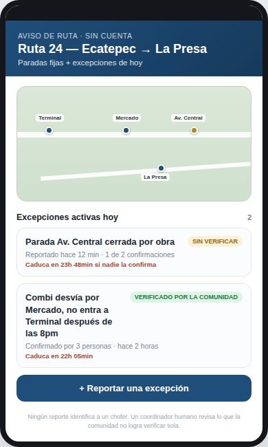
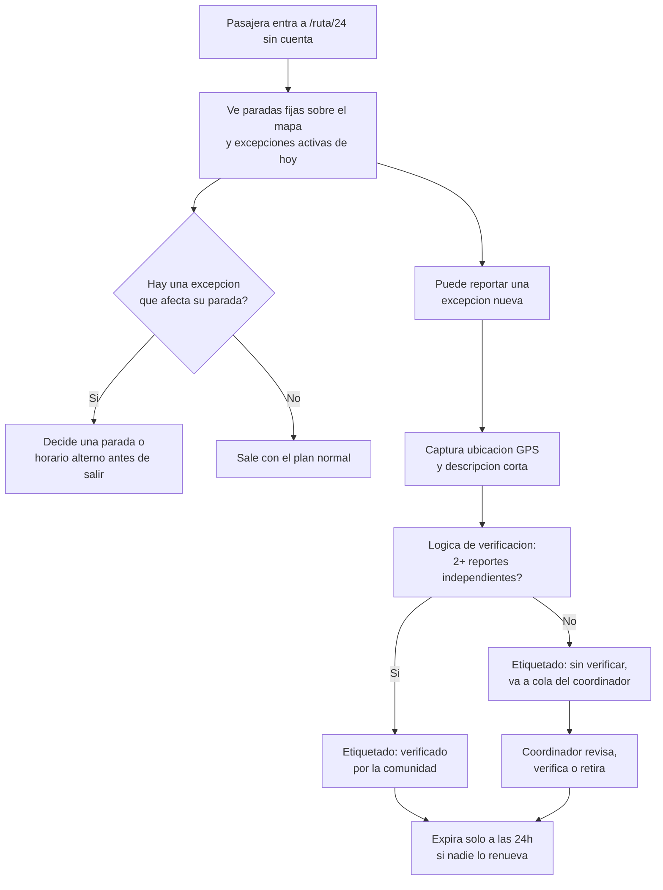
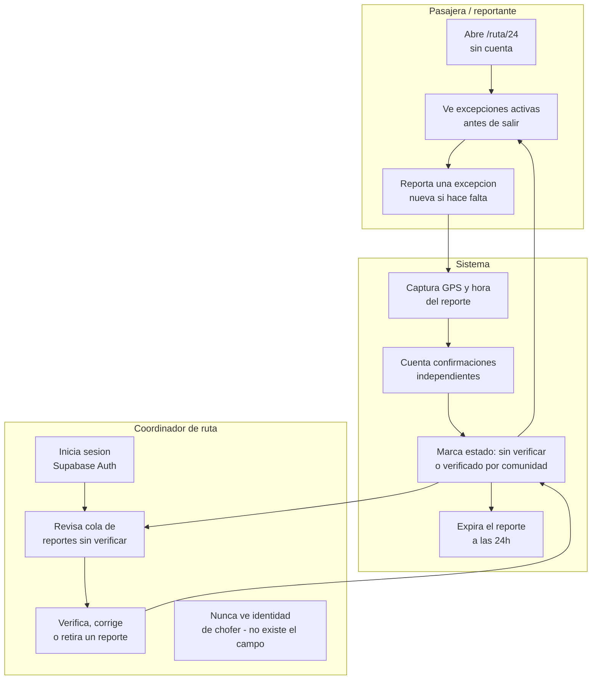

# PACKET — Aviso de Ruta: excepciones operativas de una ruta acotada (w07)

Business Bending · Cristina Meouchi (USER) · Repair Flow, Crystal Ball Studio · Team 8

## Problema, en mis palabras

Una ruta de colectivo ya está mapeada — eso lo resolvió México desde Mapatón CDMX en 2016.
Lo que no está resuelto es lo que cambia día a día: una parada que hoy no sirve por una obra,
un tramo que el chofer desvía por un bloqueo, una salida que a partir de las 8pm deja de
operar. Esa información vive únicamente en la cabeza del chofer y de quien viajó hoy — nunca
en el mapa. El Blueprint de mi equipo lo dice directo: la información estática no es lo mismo
que una capa operativa confiable, y un reporte no puede convertirse automáticamente en verdad.
Mi pieza no intenta capturar todo el conocimiento del chofer, ni su historial, ni su identidad
— ataca solo el vacío residual: la excepción de hoy, en una sola ruta, de forma voluntaria,
verificada, y que caduca sola. Es mi propia declaración en el Blueprint: apoyo el vacío solo
si no borra la excepción de acceso que hace que el problema le importe a la pasajera real —
un mapa limpio no sirve de nada si esa persona igual se queda varada.

## Usuaria exacta

Rosa, 47 años, trabaja limpiando casas en Ecatepec, Edomex. Sale de su colonia a las 6:30 a.m.
a tomar la Ruta 24 hacia La Presa. No puede pagar Uber o DiDi todos los días. Su transporte de
hoy ya depende de que el chofer conozca la zona — pero cuando ese chofer cambia, o la ruta se
desvía por una obra que ella no sabe que existe, camina 40 minutos sin ninguna advertencia
previa. No necesita el mapa completo de la ruta — eso ya lo tiene en su cabeza de tanto
usarla. Necesita saber, antes de salir de su casa, si hoy algo cambió.

## Definición de éxito

Antes de que cierre el módulo: una pasajera entra a `/ruta/24` sin cuenta, ve las paradas fijas
de la Ruta 24 sobre un mapa y, si existen, las excepciones activas de hoy (con su estado:
sin verificar, verificada por la comunidad, o próxima a caducar). Cualquier persona puede
reportar una excepción nueva desde esa misma pantalla — el reporte captura su ubicación real
por GPS del celular, pide una descripción corta, y queda etiquetado "sin verificar" hasta que
otra persona lo confirme de forma independiente o un coordinador lo revise. Todo reporte caduca
solo (24 horas por defecto) si nadie lo renueva. Ningún reporte incluye ni permite capturar la
identidad de un chofer — el esquema de datos no tiene ese campo, por diseño. Un coordinador
autenticado en `/panel` puede verificar, corregir o retirar reportes de su ruta.

## Mockup

## Diagrama de flujo

## Swimlane (más de un actor toca el proceso)

## El mejor intento del mundo (benchmark)

La mejor solución existente para mapear transporte informal es **Digital Matatus** (Nairobi,
2013): estudiantes con celulares capturaron GPS de matatus y lo convirtieron en datos abiertos
GTFS, hoy navegable en Google Maps. México ya hizo su propia versión — **Mapatón CDMX** (2016,
Laboratorio para la Ciudad, 3,594 personas, 2,632 viajes mapeados). Ambos resuelven el mapa
estático: por dónde pasa la ruta.

Mi pieza difiere en el nivel exacto donde esos dos proyectos se detienen: ninguno resuelve la
excepción de HOY — la parada cerrada, el desvío temporal, la regla informal que cambia esta
semana. Localizo el mismo principio de captura comunitaria por GPS, pero apuntado al residuo
que el Blueprint de mi equipo nombra: información que cambia, no información que ya es
estática y ya está resuelta.

## Párrafo a 3 años (charter ligero)

Si esta pieza funciona, en tres años cada ruta de colectivo con suficiente volumen de
pasajeros tiene su propia capa de excepciones vivas, mantenida por un coordinador de ruta
identificable y financiado por el mismo operador o por la delegación, nunca por perfilar al
chofer. El éxito nunca se mide en cuántas rutas se mapean desde cero — eso ya lo resolvió
Mapatón — sino en cuántas veces una pasajera como Rosa supo, antes de salir de su casa, que
algo había cambiado. Si el sistema alguna vez empieza a acumular historial de un chofer
específico para evaluarlo, ha dejado de ser esta pieza.

## Scope cut (lo que NO construyo esta semana)

- Mapeo completo de rutas nuevas desde cero — ya lo resuelve Mapatón CDMX, no es mi vacío.
- Cualquier perfil, calificación o historial ligado a un chofer identificable — cruza la frontera de datos del trabajador (Condición 5) y no lo voy a construir aunque sea técnicamente fácil.
- Más de una ruta o reclamos a nivel ciudad — el Blueprint exige empezar con una ruta acotada y un grupo voluntario (Condición 4).
- Pagos o compensación ligados a reportes — es la declaración de MONEY, y el propio Blueprint deja ese vínculo sin resolver a propósito.
- Notificaciones push o app nativa — el navegador del celular basta para esta semana.
- Un modelo de ML real entrenado — la "lógica de verificación" es una regla determinista y etiquetada (conteo de confirmaciones independientes), sustituible después por un modelo real sin cambiar el resto del sistema.

## Arquitectura + stack

| Capa | Herramienta | Notas |
|---|---|---|
| Frontend | Next.js 16 (App Router) + Tailwind CSS 4 | Reutiliza el patrón de semanas anteriores |
| Geodata | GeoJSON de paradas fijas de la Ruta 24 + mapa Leaflet/OpenStreetMap | Dragon Stack, pieza 1 |
| Telemetría | Geolocalización del navegador al reportar una excepción | Dragon Stack, pieza 2 — mismo principio que Digital Matatus/Mapatón CDMX |
| Lógica de verificación | Función determinista: 2+ reportes independientes → "verificado"; expiración a 24h | Dragon Stack, pieza 3, simulada y etiquetada — nunca ML real |
| Datos | Supabase (Postgres) | RLS activado; tabla de reportes SIN columna de identidad de chofer, por diseño |
| Acceso a datos | Service Role Key, solo en servidor | `crearClienteSupabaseServidor()`, marcado `server-only` |
| Autenticación | Supabase Auth (correo/contraseña) | Solo protege `/panel` del coordinador — reportar y consultar `/ruta/24` es público, sin cuenta |
| Despliegue | Vercel | Igual que semanas anteriores |

## Plan de pruebas

1. Entrar a `/ruta/24` sin ninguna cuenta → carga el mapa y las paradas fijas, sin pedir login.
2. Reportar una excepción nueva → se guarda con estado "sin verificar", ubicación capturada por GPS, hora de expiración a 24h visible.
3. Reportar la misma excepción desde otro alias → al llegar a 2 confirmaciones independientes, el estado cambia a "verificado por la comunidad".
4. Esperar (o forzar en pruebas) que pase la expiración → el reporte deja de mostrarse como activo en la vista pública.
5. Entrar a `/panel` sin sesión → redirige a `/panel/login`.
6. Iniciar sesión correcta en `/panel` → se ve la cola de reportes de la Ruta 24, con opción de verificar, corregir o retirar cada uno.
7. Revisar el esquema de la base de datos y la interfaz completa → en ningún lugar existe un campo o pantalla que identifique a un chofer específico, ni un historial acumulado por persona.
